This tutorial describes the basic steps needed to set up a development environment with NodeJS, TypeScript, and VisualStudio Code.
At the end of this tutorial, you should have a complete local development environment that you can use to build and test
code for this class.

Contents:
* [Installing NodeJS](#installing-nodejs)
* [Installing Visual Studio Code](#installing-visual-studio-code-vscode)
* [Hello, World in TypeScript](#getting-started-with-typescript)

If you run into any difficulties following any of these steps, please post (in a non-private question) on Piazza.

# Installing NodeJS

Node.js is a JavaScript runtime built on Chrome's V8 JavaScript engine.

For this class, you will need Node.js version 16 (16.13.2 is the latest version at time of writing, although any 16.x shoudl work in theory). 
There are many ways that you can install Node.js: for instance, you can use a package manager like
`snap` or `homebrew` to install it; you can download an installer directly from the Node.js website, and you can,
of course, build it from source. However, due to the complexity of running different Node.js versions on the same machine, we *very strongly* suggest using `nvm`, as explained below.

We recommend installing Node.js using [nvm, the node version manager](https://github.com/nvm-sh/nvm). When language runtimes
are in active development (like Node.js is), sometimes you end up needing to have multiple versions of Node.js installed,
and different projects that you work on might require different versions of Node.js. These annoyances are quite rare,
but when it happens that you need to have mutliple versions of Node.js installed, it's super handy to have your system set up already
so that installing multiple versions and switching between it is easy. You can use our instructions to set up nvm even if you
have previously installed Node.js.

## Installing NodeJS with NVM for Windows

1. Download `nvm-setup.zip` from the most recent release of [nvm-windows](https://github.com/coreybutler/nvm-windows/releases) (at time of writing this document, version 1.1.9).
   - 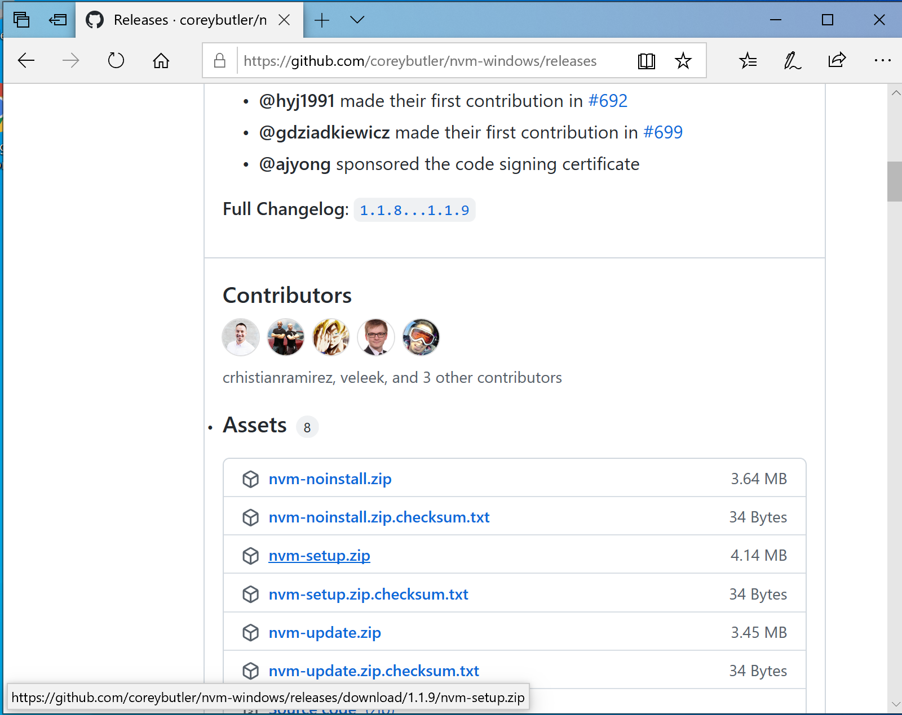
2. Extract the contents of `nvm-setup.zip` and run the executable `nvm-setup.exe`.
   - This should open the nvm installation wizard.
3. Accept the license agreement and click next. Continue to accept the default choices for any remaining prompts, and click "install". If you receive messages along the lines of "NodeJS version XYZ is already installed, would you like nvm to control this installation," select "Yes". 
7. Upon completion, you will see the below window
   - 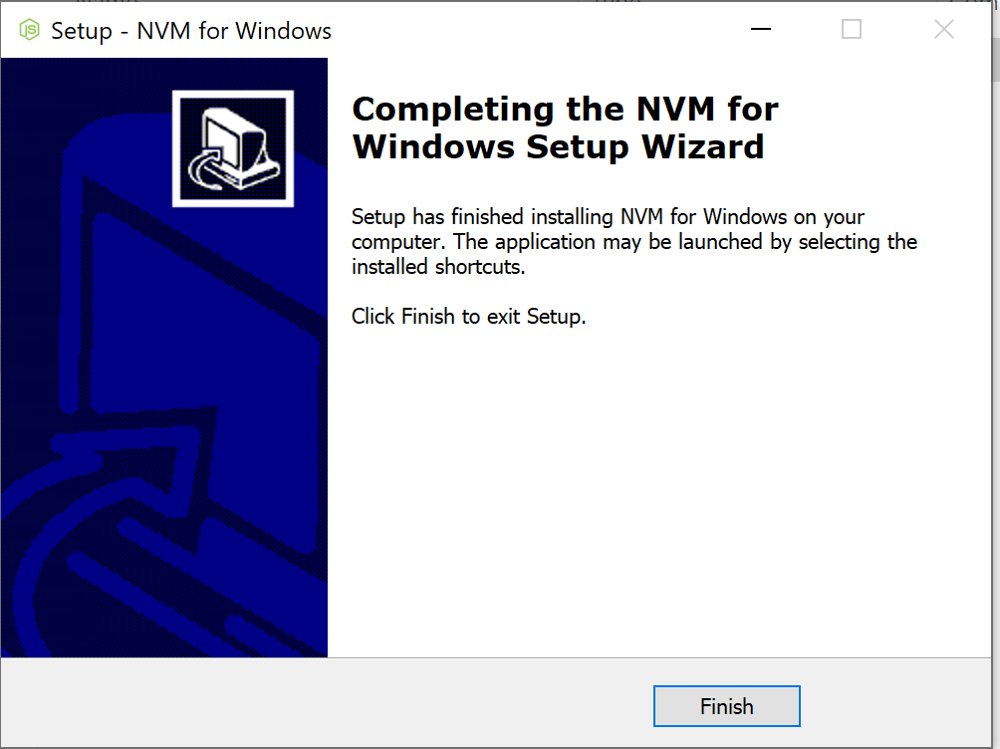
8. Open a command prompt with administrative privileges (type `cmd` in the windows start bar, then select "Run as administrator").
9. Verify the installation, run the command `nvm version`
   - This should display the version of nvm installed.
   - 
10. Run the command `nvm list available` to display all available NodeJS versions.
   - 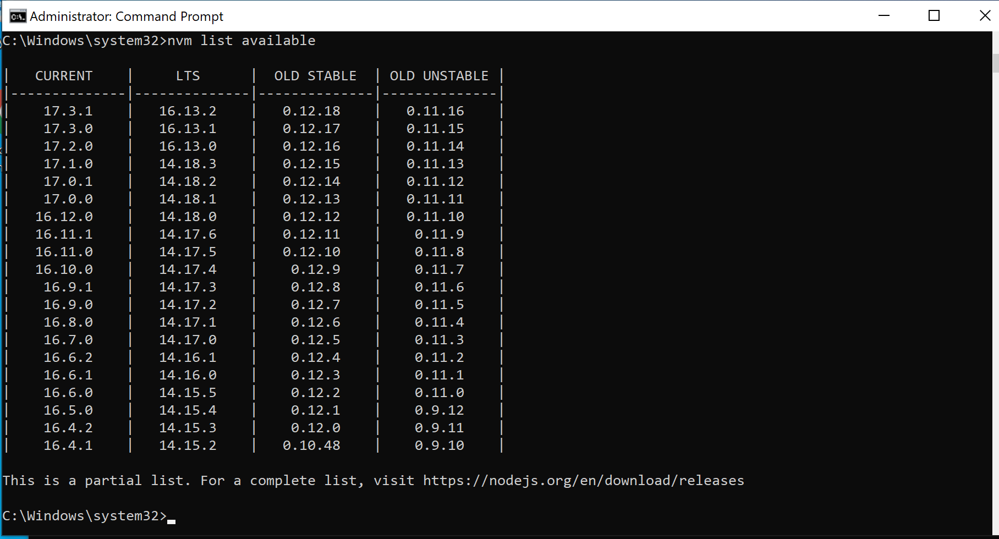
11. Install the latest LTS (Long term supported, as opposed to the "development") version of Node.js available using the command `nvm install 16.13.2`.
12. To use this version of NodeJS, run the command `nvm use 16.13.2`.
13. Now, NodeJS should be installed and ready for use. To verify the installation run the below commands:
   - `node -v`
   - `npm -v`
   - 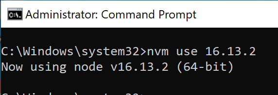

*Troubleshooting with VSCode*: Did you follow these instructions successfully, but find a "Command not found" error when you try to run `npm` in VSCode? Try this: Close VSCode completely. Re-open it. In your command shell in VSCode, try again. We have noticed that if you have VSCode open while installing `nvm`, it is possible that VSCode will not see the new software installation until it's closed and re-opened. You can also confirm that VSCode correctly sees the NodeJS installation by running `echo %PATH%` in your windows command shell in VSCode: it should include an entry similar to `C:\Program Files\nodejs`.

## Installation Steps (Linux / Mac)

1. Run either `curl -o- https://raw.githubusercontent.com/nvm-sh/nvm/v0.39.1/install.sh | bash` or `wget -qO- https://raw.githubusercontent.com/nvm-sh/nvm/v0.39.1/install.sh | bash`.
2. Close and reopen a terminal.
3. Verify nvm is working by entering `command -v nvm`. If your terminal prints
out `nvm`, it should be working. If you see `nvm: command not found` or no
feedback, open a new terminal and trying again or restart from step 1.
4. Install the latest LTS (Long term supported, as opposed to the "development") version of Node.js by typing `nvm install 16`.

## Verification

1. Open a shell or windows powershell.
2. Run the command `node -v`
  - This should print the current version of nodeJS installed (v16.x.x)
3. Run the command `npm -v`
  - This should print the current version of npm installed (v8.x.x)
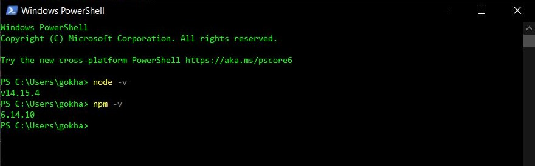
4. If you find that some other version is being used, and would like to change the default to 16, run the command `nvm alias default 16`

# Installing Visual Studio Code (VSCode)

Visual Studio Code is a lightweight but powerful source code editor which runs on your desktop and is available for Windows, macOS and Linux. It comes with built-in support for JavaScript, TypeScript and Node.js and has a rich ecosystem of extensions for other languages (such as C++, C#, Java, Python, PHP, Go) and runtimes (such as .NET and Unity). VSCode also supports importing hotkey configurations from most other text editors and IDEs. Read more [here](https://code.visualstudio.com/docs).
While you are required to use *an* IDE for this class, it is not mandatory to use VSCode: if you already are comfortable developing TypeScript or JavaScript
in another suitable IDE (like IntelliJ), then you are welcome to continue to use that. However, VSCode is the
"supported" option: if you struggle to get things like the linter set up correctly in VSCode, we will be happy to help you. 
However, we can't provide such support for all IDEs. 
## Pre-requisites

- Administrative access on the host machine for software installation.

## Installation Steps (Windows / Mac)

1. Download the VSCode installer from the [VSCode website](https://code.visualstudio.com/download).
   - 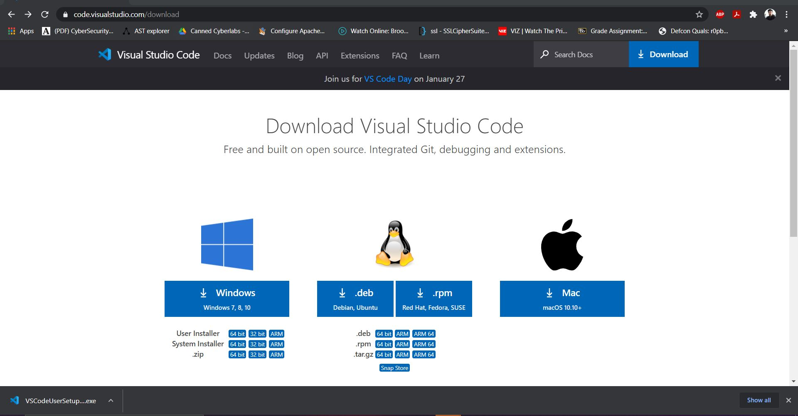
2. Run the installer to start the installation wizard for VSCode
   - 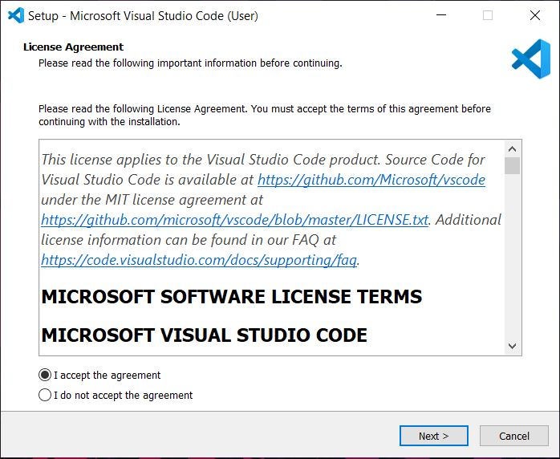
3. Accept the license agreement and click next.
   - 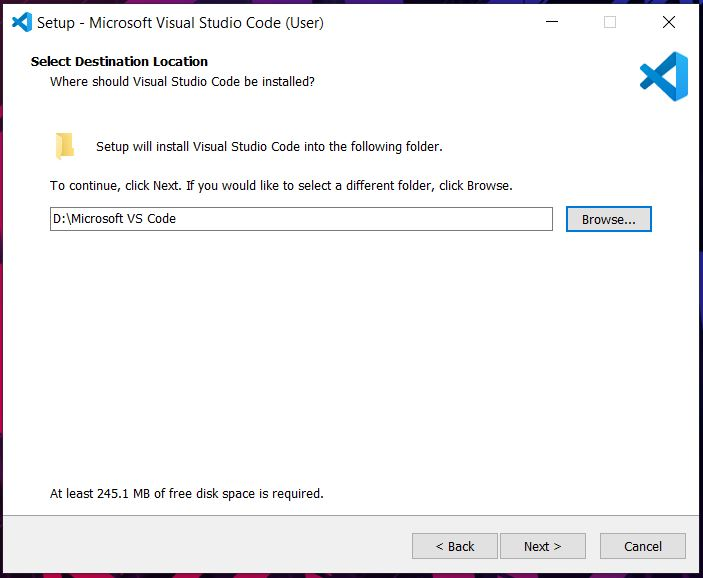
4. Choose the installation directory of your choice and click next.
   - 
5. Click next on the select start menu folder screen.
   - 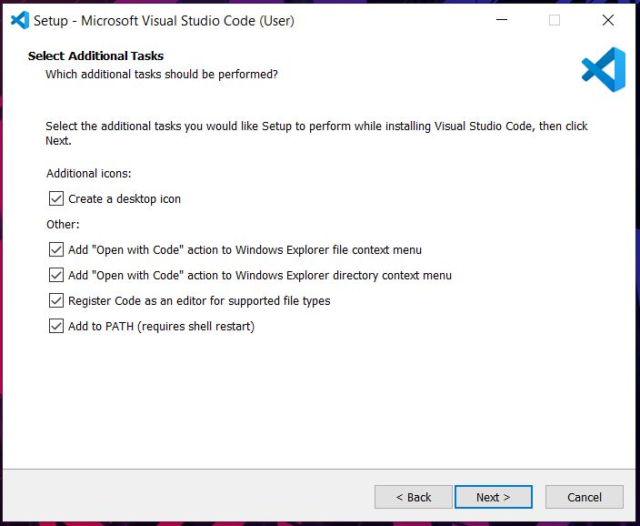
6. Tick all check boxes on the select additional tasks menu and click next.
   - 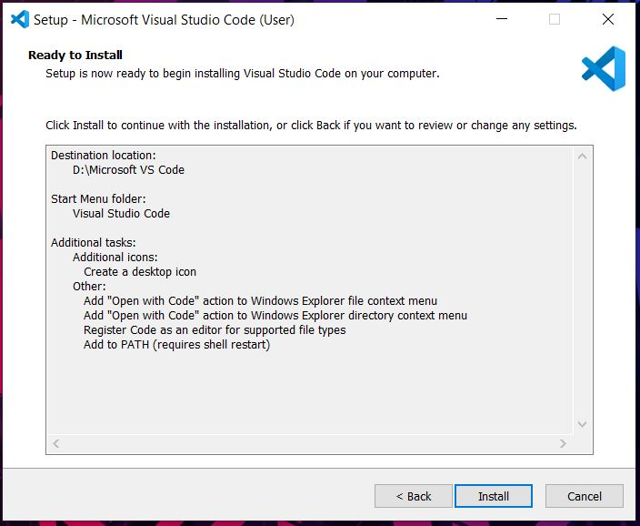
7. Review the settings on the the "Ready to install" screen and click Install to begin installation.
8. Once the installation is complete, you will see the below screen and you are ready to use VSCode.
   - 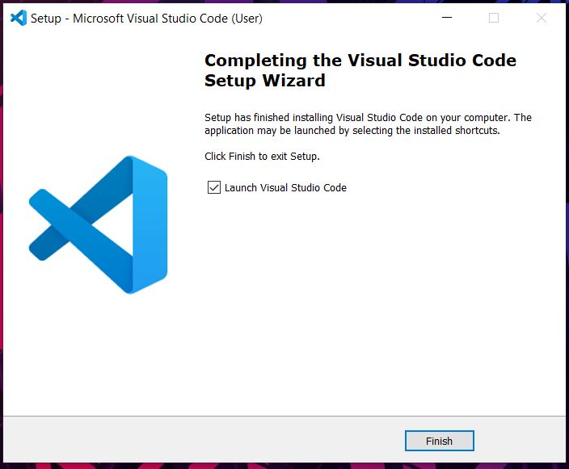

## Installation (Linux)

- The above instructions for Windows/Mac should also work, but VSCode is also provided as a snap package

1. Install snap if you haven't already by running `sudo apt update` and then `sudo apt install snapd`.
2. Install VSCode by running `sudo snap install --classic code`.
3. Open VSCode as an application on your desktop.

## Additional Extensions (Optional)

VSCode comes with a rich set of extensions to aid in software development.
Below is a list of extensions that you may find useful.

1. GitLens - Git Supercharged
2. Prettier - code formatter
3. vscode-icons
4. ESLint
5. Andromeda (Color theme: Andromeda Colorizer)

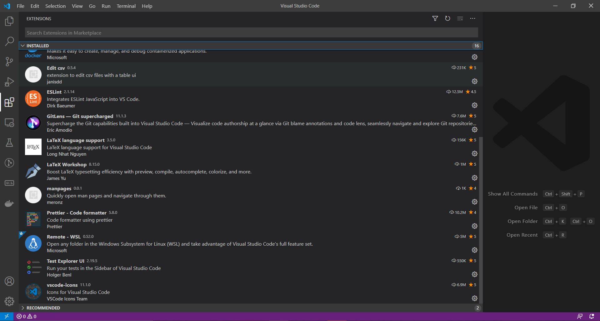

## Installing Extensions (eg. ESLint)

1. Click on the extensions tab on the left in VSCode.
2. Search ESLint.
3. Click on Install.
4. Done!
    - 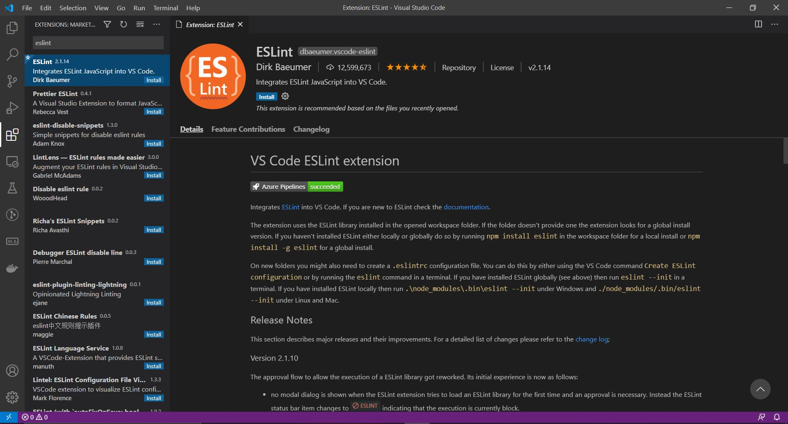


# Getting Started With Typescript

Typescript is a superscript of JavaScript which adds type information and other features.

## Pre-requisites

- NodeJS
- VSCode (recommended but not required)

## Installation

1. Open VSCode and press the ctrl + `~` (Tilde or back tick key) to open a terminal.
  - Optionally you can open a separate shell (Do not use powershell)
2. Run the command `npm install -g typescript` in the terminal.
  - Typescript should now be installed globally and accessible from the terminal.
3. Verify the installation using the command `tsc -v` in the terminal. (Do NOT use powershell)
  - 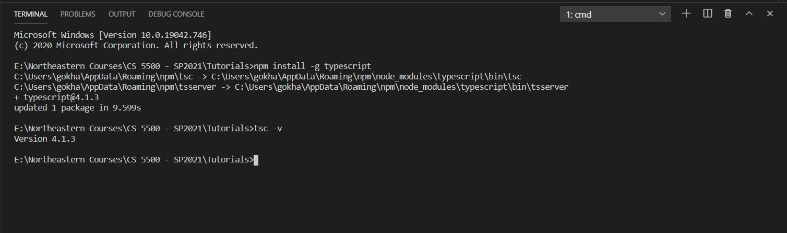

## Hello World

1. Create a new directory and open it with VSCode.
2. Create a new file called `hello-world.ts`
3. Add the following code to the file:
  ```
    console.log('Hello, World!');
  ```
4. Open the terminal with ctrl + `~`.
  - Ensure that you are in the same directory as `hello-world.ts`.
5. Run the command `tsc hello-world.ts`
  - This will generate a JS file called `hello-world.js`
6. Run the file with node using the command `node hello-world.js`.
  - This will give the result below.
  - 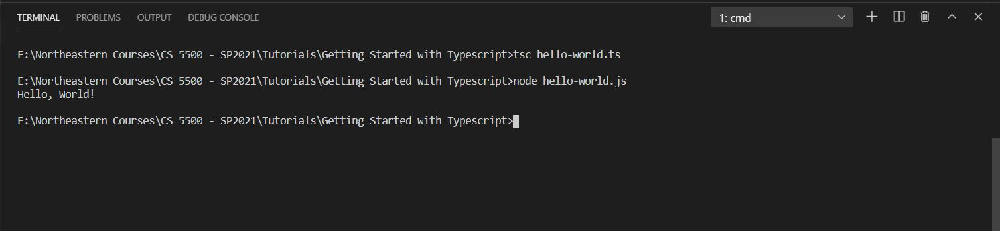
