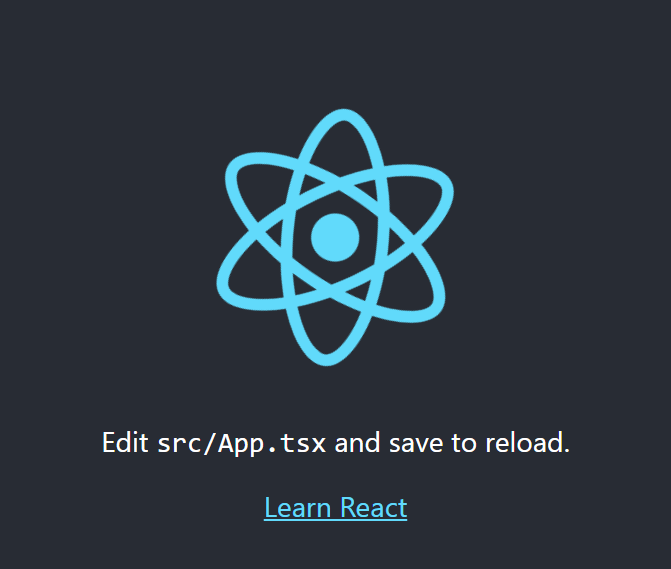

# React Basics

This tutorial covers the basic concepts of react. By the end of this tutorial, you will be able to create a new react app, understand the basic concepts of react such as states and props, understand React hooks and handling events.

-   [React Basics](#)
-   [Creating a new React App](#)
-   [Understanding a React App](#)
    -   [Components](#)
    -   [Props](#)
    -   [Handling Events](#)
    -   [The this problem](#)
-   [React Hooks](#)
    -   [State and Event Binding](#)
    -   [Lifecycle Hooks](#)

# Creating a new React App

Let's use **npx** and **create-react-app** to create a new React project

-   **npx** stands for Node Package Execute. It is a runner that can execute any package that you want from the npm registry without even installing that package. In this case npx tool temporarily installs the create-react-app npm package and uses it to create our project.

-   **create-react-app** is a command-line tool that we can use to quickly create a React and TypeScript app with lots of useful pieces.

1. We use the create-react-app npm package to create a React and TypeScript project by entering the following:

    ```ts
    npx create-react-app my-app --typescript
    ```

    - Note 1: This will create a new project directory called my-app under the current directory.
    - Note 2: This will create a git repo in my-app, so you probably shouldn't do this inside a pre-existing git repository.

2. Navigate to the project directory using the command:
    ```ts
    cd my-app
    ```
3. To start the development server for React, run the command:
    ```ts
    npm start
    ```
4. Navigate to http://localhost:3000/ to see the default react page.
    - After a few seconds, a browser window opens, with our app running:
      

## React Component
React follows a Component based architecture, which consists of various components and interactions between. A component can be considered a repeatable html element with built-in state, business logic, and a lifecycle. A component may be something as simple as a single html element such as an input box, or a button, or a complex entity made up of other components such as the Root (App) component.

Components are the basic building blocks of a React application and they allow the developer to split the UI into independent and reusable
pieces where each piece can be used in isolation. 
### Creating a function component in react
The simplest method to define a component is to write a function in Javascript. These components are also widely referred as functional stateless components but in the recent versions of React, they have the capabilities to contain state as well.
```ts
import * as React from "react";

const App: React.SFC<IProps> = (props) => {
  return (
      <div className="App">
        <h1>Welcome to React with Typescript Tutorial.</h1>
  </div>
);
}

export default App;
```

### A few things to note about React components:

- The root (App) component is the entry point for the React App and all other components are nested in it.
- We define a function component using an arrow function, passing the props type in as a generic parameter.
- The import statement is used to import the public classes/functions from the `react` library.
- We use stateless functional component (SFC) React.SFC to represent these type of components.
- A function can return a single top level element. 
  - div is the top level element in this case and other elements can be nested in it.
    - The attribute `className` is used to specify a CSS class name if CSS properties have been defined seperately for a class.
    - `className` attribute is used to set or return the value of an element’s class attribute. Using this property, the user can change the class of an element to the desired class.
- The round brackets (()) after return are used to span a JSX/TSX element across multiple lines.
- At last , the component needs to be exported from the current file, so that it can be imported somewhere else and can be used either in isolation or combination with other components for rendering on the UI.
- Elements on one line can be returned directly.
- Each instance of a component creates a new element independent of other instances on the component.
- Each component has it's own state, props, and lifecycle (which will be explored later in the tutorial).


## Props
React components are similar to JavaScript functions and can accept arbitrary arguments called props. Since components are reusable, props are especially useful to display different content in each instance of the component. Let us extract the header elements from the previous code snippet into a new component called Header. We can then use props to say "hello" to different users.

- Create a new file in `src/` directory called `Header.tsx`
- Create and export a function called Header in the file as below:
```ts
 const Header: React.SFC<IProps> = (props: {name?: string}) => {

    return (
      <h1> Hello, {props.name} </h1>
    );

  }

  Header.defaultProps = {
    name: 'World'
  };

  export default Header;
```

- The above code snippet creates a new function component `Header` and prints the value of the `name` passed in the props.
- It defines a defaultProps for the component `Header` where the default value for `name` is used in case the value for props for `name` is not passed in any instance of the component.


- In App.tsx:
  - Remove the code in h1 tags.
  - Import the Header component as below:
    - ```ts
       import Header from './Header';
      ```
  - Update the contents of return as below:
    - ```ts
       <header className="App-header">
         <Header />
         <Header name="John" />
         <Header name="Jane" />
       </header>
      ```
  - Save all files and run npm start

A few things to note from the above example:

- Component.defaultProps can be used to specify default values for props.
- Curly braces ({}) in JSX/TSX are used for one-way data binding.
  - In our example, `{props.name}` will display the value of `name` in the html for the cases when the values "John" and "Jane" are passed as props.
  - If no props are passed for an instance of the component, then it will display the default value of props.

### Template for structure of function component
```ts
import * as React from "react";

const ComponentName: React.SFC<IProps> = props => {
 const handler = () => {
 ...
 };

 return (
  <div>Our TSX</div>
 );
};
ComponentName.defaultProps = {
 ...
};

export default ComponentName;
```

# Handling Events

-   React impelemnts its own system of handling events that is very similar to handling events on DOM elements. There are some syntax differences:
    -   React events are named using camelCase, rather than lower case.
    -   With JSX a function can be passed as an event handler instead of a string.

For example, the HTML

```html
<button onclick="incrementCounter()">
    Increment Counter
</button>
```

is slightly different in React:

```html
<button onclick={incrementCounter}>
    Increment Counter
</button>
```

## React Hooks
React hooks are built-in functions which allows us to use state and other lifecycle features. The most basic hooks used by react are useState() which adds a state variable to a react component and useEffect() which is the lifecycle hook for a component. State of component referes to the data it is holding at a particular moment in time.

### useState():
In this section we will see how we can add state to a React Component using the useState() hook provided by React.
1. We'll start by defining and initializing state for the number of times the button is clicked, by adding the a state variable as follows:
```ts
import {useState} from 'react';

function Counter() {
    const [count, setCount] = useState(0);
    ...
}
```
This line of code looks a little strange, so let's break it down:

* First, we import the useState from react library.
* useState is a React function that lets us create state, passing in a default value as a parameter. In our case, we pass it a default value of 0.
* The useState function returns an array containing two elements:
* * The first array element contains the current value of state.
* * The second array element contains a function to set state to a different value.
* We destructure the array and store the first array element (the state value) in count, and the second array element (the function to set state) in setCount.
* The rest of the function now has access to the count, via the count variable. The function is also able to increment the count, via the setCount variable.   

2. Let's add a function to update the state of the variable:
```ts
function incrementCount() {
    setCount(count + 1);
  }
```
* Now, functions to set the piece of state take in the new state as their parameter.

3. Next we'll make the component return the count along with a button to increment the count when clicked. Final function code will be as follows:
```ts
import {useState} from 'react';
function Counter() {
  const [count, setCount] = useState(0);
  function incrementCount() {
    setCount(count + 1);
  }
  return (
    <div>
      <h1>Count: {count}</h1>
      <button onClick={incrementCount}>Click me!</button>
    </div>
  );
}

export default Counter;
```
If we give this a try in the running app, we should find the count variable's value to keep incrementing by one every time the button is clicked.
After we've got our heads around the code needed to define state, accessing and setting state is fairly simple and elegant.

### useEffect():
Now let's have a look at how to invoke the code to execute at a certain point in the component's lifecycle.
Older versions of React consisted of different Lifecycle hooks that allowed a user to hook into various phases of component rendering such as componentDidMount, ComponentDidUpdate, etc. which have all been condensed into a single function called useEffect(). Let us observe how this hook behaves by printing out the count in browser console.

1. As always, we  will start by importing the function from the react library:
```ts
import {useEffect} from 'react';
```
 2. Next we will add the function to our existing counter component:
 ```ts
 useEffect( ()=> {
   console.log(`The current count is ${count}`);
 },[])
 ```
 Let's break down this code to understand what is happening:
 * We use React's useEffect function to hook into the component life cycle.
 * The function takes in an arrow function, which executes when the component is first rendered.
 * The function takes in a second parameter, which determines when our arrow function is called. This parameter is an array of values that, when changed, will cause the arrow function to be invoked. In our case, we pass in an empty array, so our arrow function will never be called after the first render.
 * If we now try the running app and open the console, we'll see Counter first rendering only appears once.

 3. Let's remove the second parameter into useEffect now:
 ```ts
 useEffect( ()=> {
   console.log(`The current count is ${count}`);
 });
 ```
 * Now we can see that the componenet will render everytime the value of count is changed.
 * Additionally we can also pass the variable in the array to observe only changes related to a particular value:
 ```ts
 useEffect( ()=> {
   console.log(`The current count is ${count}`);
 },[count]);
 ```

 4. Finally, our component counter will look like:
 ```ts
import {useState} from 'react';
import {useEffect} from 'react';

function Counter() {

  const [count, setCount] = useState(0);

  function incrementCount() {
    setCount(count + 1);
  }

  useEffect( ()=> {
    console.log(`The current count is ${count}`);
  });

  return (
    <div>
      <h1>Count: {count}</h1>
      <button onClick={incrementCount}>Click me!</button>
    </div>
  );
}

export default Counter;
 ```
