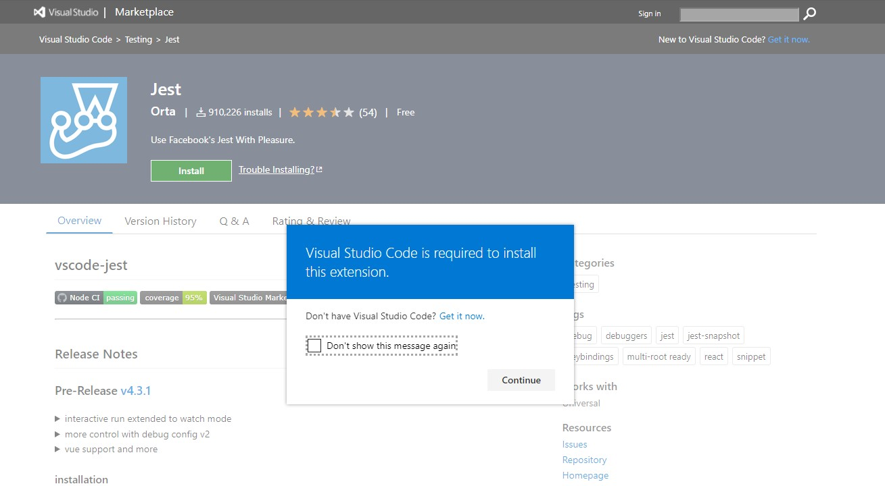
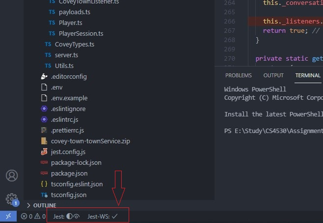
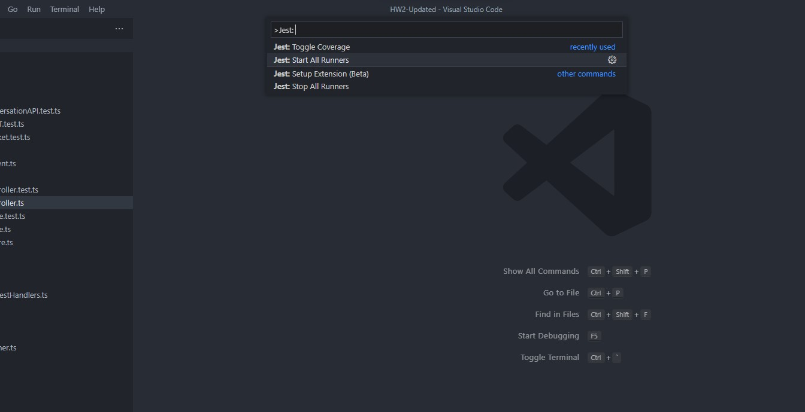
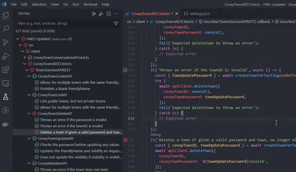
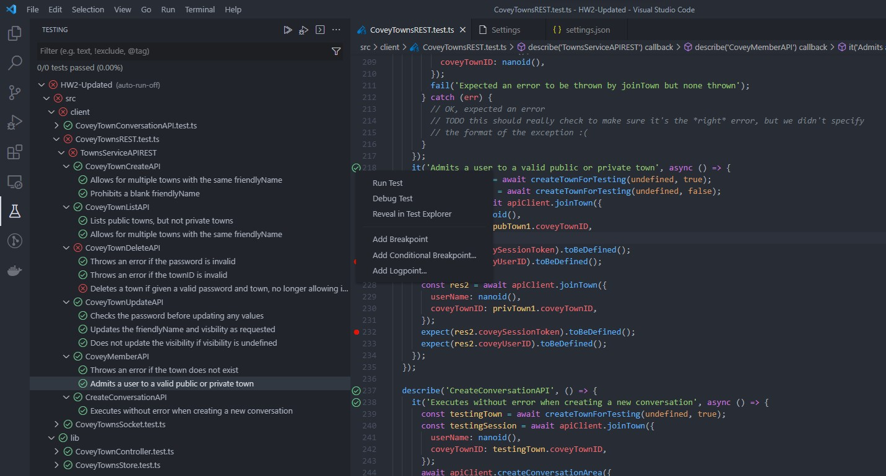
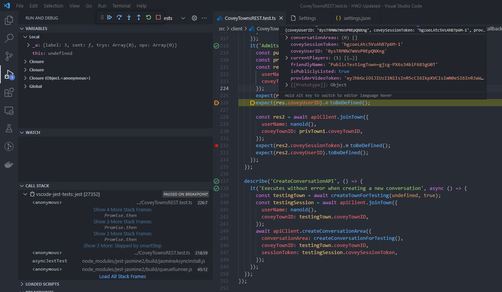

This tutorial covers the basics on unit testing with Jest. By the end of this tutorial, you will have an introduction to unit testing with jest, best practices, and some handy tricks and tips to use in your tests. Starter code is available [here](./assets/week5-unit-testing/week5-tutorial-starter-code.zip), and finished code with tests covered in this tutorial can be found [here](./assets/week5-unit-testing/week5-unit-tests.zip). We strongly recommend using the completed solution only for reference and implementing the tutorial step by step from the starter code.

Contents:

- [Understanding Unit Testing](#understanding-unit-testing)
- [Testing with Jest](#testing-with-jest)
  - [Basics](#basics)
    - [Specs](#specs)
  - [Matchers](#matchers)
    - [.toEqual() vs .toBe() vs .toStrictEqual()](#toequal-vs-tobe-vs-tostrictequal)
  - [AAA](#aaa)
    - [Assemble](#assemble)
    - [Act](#act)
    - [Assert](#assert)
  - [Setup and Teardown](#setup-and-teardown)
  - [Mock Testing](#mock-testing)
    - [Spy](#spy)
    - [Mock](#mock)
    - [Stub](#stub)
  - [Testing Asynchronous Code](#testing-asynchronous-code)
    - [Promise](#promise)
    - [Callbacks](#callbacks)
- [Setting up testing using Jest in VSCode](#setting-up-testing-using-jest-in-vscode)
  - [Features](#features)
  - [Installation](#installation)
    - [Direct Installation](#direct-installation)
    - [From Visual Studio Marketplace](#from-visual-studio-marketplace)
  - [Configuration](#configuration)
  - [Debugging Tests](#debugging-tests)
- [General Guidelines For Writing Tests](#general-guidelines-for-writing-tests)


# Understanding Unit Testing
At some point, every programmer has wondered why they should spend time writing test cases instead of focusing on implementing a new feature. The reason for this is that it is important! In this tutorial, we'll go through several aspects of unit testing, with a focus on utilizing Jest. Before we get into that, let's define unit testing and why it's so important in the real world.

Unit testing is not a new concept; it has been around for a long time. "Unit tests are often automated tests prepared and executed by software engineers to check that a portion of an application (referred to as a "unit") matches its design and behaves as expected," according to Wikipedia. So, to put it another way, it's a technique to undertake rigorous testing of every single function/module in isolation.

Unit testing technques:
- **Black Box Testing** : It is a process of validating a function's input and output without any knowledge of it's internal implementation details.
- **White Box Testing** : Unlike Black Box testing, white box testing focuses on testing the specific internal code flows, uncovering any unidentified error or bug in that component.
- **Gray Box Testing**  : Gray Box testing is a combination of the two above wherein partial knowledge of the internal code is needed. This strategy lowers a tester's reliance on a developer for every minor issue, allowing the tester to detect and resolved it alone.

# Testing with Jest
## Basics


To understand the basics of unit testing, let us look at the file called 'calculator.ts' present in the directory src/services/math/. This file contains a class called Calculator with a method for add() defined as shown below:

```ts
  // Contents of src/services/math/calculator.ts

  export default class Calculator {
    public add(num1: number, num2: number): number {
      const result: number = num1 + num2;
      console.log("The result is: ", result);
      return result;
    }
  }
  ```

Let us write some tests for this code using jest. The test code will go into a file in the same directory titled 'calculator.spec.ts'. Create this file now. This pattern of 'file-name.spec.ts' is how you should name all of your test files when using jest.


All test files start with a suite. A suite is a collection of tests (or a logical grouping of tests). In jest, a suite is created by using the function `describe()`. The suite takes 2 arguments: the 1st being the description of the suite and the second being a callback function. Additionally, suites can be nested to form logical groups.
Suites can further be broken down into 3 components that we will explore in detail shortly:

1. Setup
2. Teardown
3. Test

Syntax:

```ts
  describe("Description of suite", () => {
    // The tests go here.
  });
  ```

Suites can be used to make debugging easier when you are using a large number of tests. Here is one recommended suite hierarchy:

- Top level describe should contain the file path after src.
- Second describe should contain the name of the Class/File being tested.
- Subsequent describe blocks should contain the name of the function being tested.

Using this hierarchy, the test file for the above example would look as follows:

```ts
  describe("services > math", () => {
    describe("Calculator", () => {
      describe("add()", () => {
        // Tests for add() go here.
      });
    });
  });
  ```

### Specs

A spec is an actual test that executes some code and asserts some result. A test is created using the keyword `it()` or `test()`. Similar to `describe()`, `it()` takes 2 arguments, the first being the description of the test and the second being a callback. Generally, we want to describe what the code _should_ do in the description of `it()` and assert the described behavior within the test. Each test can be broken down into 3 parts (Assemble, Act, Assert) which makes up the AAA pattern. Optionally, there may be a clean-up/teardown step after the assert.

Syntax:

 ```ts
  it("should check a specific behaviour", () => {});
  ```

Let us write a simple test for our add() method to check 1 + 1 = 2.
We start by adding a spec to the suite we created previously.

```ts
  describe("services > math", () => {
    describe("Calculator", () => {
      describe("add()", () => {
        it("should return 2 when inputs are 1 and 1", () => {
          // Assemble
          // Act
          // Assert
        });
      });
    });
  });
  ```


## Matchers
### .toEqual() vs .toBe() vs .toStrictEqual()

All three matchers are used to test equality, though they have slight but important differences. To understand these differences, let us take a look at the example of Store.ts with the below code.

 ```ts
  export default class Store {
    private static _data: any = null;

    public static getData(): any {
      return Store._data;
    }

    public static setData(data: any): void {
      Store._data = data;
    }
  }
  ```

1.  Use .toEqual() to compare recursively all properties of object instances (also known as "deep" equality). It calls Object.is to compare primitive values, which is even better for testing than '===', the strict equality operator.
    This is the most commonly used matcher.

```ts
  describe("utils > store", () => {
    describe("Store", () => {
      beforeEach(() => {
        Store["_data"] = undefined;
      });

      describe("setData()", () => {
        it("should assign the input data to Store._data", () => {
          const mockData = { key: "value" };

          Store.setData(mockData);

          expect(Store["_data"]).toEqual(mockData);
        });
      });

      describe("getData()", () => {
        it("should return an object equal to Store._data", () => {
          const mockData = { key: "value" };
          Store["_data"] = mockData;

          const returnedValue = Store.getData();

          expect(returnedValue).toEqual(mockData);
        });
      });
    });
  });
  ```

2.  Use .toBe() to compare primitive values or to check referential identity of object instances. It calls Object.is to compare values, which is even better for testing than '===', the strict equality operator.

 ```ts
  describe("getData()", () => {
    it("should return an object with a reference different to Store._data", () => {
      const mockData = { key: "value" };
      Store["_data"] = mockData;

      const returnedValue = Store.getData();

      expect(returnedValue).toEqual(mockData);
      expect(returnedValue).not.toBe(mockData);
      expect(Store["_data"]).toBe(mockData);
    });
  });
  ```

3.  Use .toStrictEqual() to test that objects have the same types as well as structure.
    This checks for undefined in Objects and sparseness in Arrays.
    - { key: undefined } is not strictly equal to { }.
    - [ , 1] is not strictly equal to [undefined, 1].

 ```ts
  it("should return an object strictly equal to object stored in Store._data", () => {
    const mockData = { key: "value" };
    const mockDataWithUndefined = { key: "value", key2: undefined };
    Store["_data"] = mockData;

    const returnedValue = Store.getData();

    expect(returnedValue).toStrictEqual(mockData);
    expect(returnedValue).toEqual(mockDataWithUndefined);
    expect(returnedValue).not.toStrictEqual(mockDataWithUndefined);
  });
  ```
## AAA
### Assemble

In order to run a test, we need to first assemble it. This may include creating instances of classes/variables, setting up test data for inputs, setting up spies/stubs/mocks (which will be covered in subsequest sections), or setting up the expected output. In simple cases, one may not need to assemble the test. This phase is very similar to the setup phase.

In our example, let us create an instance of the Calculator class as part of assembling the test.

```ts
  import Calculator from "./calculator";

  describe("services > math", () => {
    describe("Calculator", () => {
      describe("add()", () => {
        it("should return 2 when inputs are 1 and 1", () => {
          const calculator: Calculator = new Calculator();

          // Act

          // Assert
        });
      });
    });
  });
  ```

### Act

In this step, we actually execute the function under test with required inputs and get the returned result (if any).

In our example, we will invoke the add() method with inputs (1, 1) and get the result.

 ```ts
  import Calculator from "./calculator";

  describe("services > math", () => {
    describe("Calculator", () => {
      describe("add()", () => {
        it("should return 2 when inputs are 1 and 1", () => {
          const calculator: Calculator = new Calculator();

          const result: number = calculator.add(1, 1);

          // Assert
        });
      });
    });
  });
  ```

### Assert

Assertion is a statement that validates the behavior of our code by comparing the actual result against the expected results. There are many assertions provided by Jest, including some useful assertions we will use throughout our tests. Some of these assertions are listed below:

- `expect(actual).toEqual(expected)` // Expects both entities to have the same value.
- `expect(actual).toBe(expected)` // Expects both entities to be the same.
- `expect(spy/stub/mock).toHaveBeenCalled()` // Expects a function being spied/stubbed/mocked to be invoked.
- `expect(spy/stub/mock).toHaveBeenCalledWith([arguments])` // Expects a function being spied/stubbed/mocked to be invoked with specified arguments.
- `expect(actual).toBeDefined()` // Expects the entity to be defined.
- `expect(actual).not.` // Negates the assertion. Can be chained with any matchers above
- `await expect(error causing code returning a promise).rejects.toThrowError()` // Waits for the error throwing code that returns promise (e.g. an API call) to throw the error and asserts the error was thrown.

A full list of matchers can be found [here](https://jestjs.io/docs/en/expect).

In our example, we can use the .toEqual() matcher.

```ts
  import Calculator from "./calculator";

  describe("services > math", () => {
    describe("Calculator", () => {
      describe("add()", () => {
        it("should return 2 when inputs are 1 and 1", () => {
          const calculator: Calculator = new Calculator();

          const result: number = calculator.add(1, 1);

          expect(result).toEqual(2);
        });
      });
    });
  });
  ```

## Setup and Teardown

Often in tests, we need some things to happen before a test actually runs and some things to happen after it. This may include resetting/initializing values, setting up test data, setting up spies/stubs/mocks, cleaning up variables after a test, or resetting spies/stubs/mocks. Sometimes these steps may need to be repeated for each test. This is where the setup and teardown can be especially useful.

Jest Provides 2 methods for setup and 2 methods for teardown:

- beforeAll(): Runs one time before all the tests in a suite.
- beforeEach(): Runs before every test in a suite.
- afterEach(): Runs after every test in a suite.
- afterAll(): Runs once after all tests in a suite.

In our example, notice we created an instance of calculator in our Assemble phase. We will probably have multiple tests for the calculator that will require this instance. In order to avoid repeating this in every step, let us move this to the setup phase and add a teardown to clear this after all tests.

_Note:_ Use beforeEach()/afterEach() if the function/class stores state, and we need a clean instance for each test. In our case, calculator does not store any state, and we can share the same instance across tests with out any side effects. Hence, we will use beforeAll()/afterAll().

```ts
  import Calculator from "./calculator";

  describe("services > math", () => {
    describe("Calculator", () => {
      describe("add()", () => {
        let calculator: Calculator;

        beforeAll(() => {
          calculator = new Calculator();
        });

        afterAll(() => {
          calculator = undefined;
        });

        it("should return 2 when inputs are 1 and 1", () => {
          const result: number = calculator.add(1, 1);

          expect(result).toEqual(2);
        });
      });
    });
  });
  ```

Let us add another test to cover a different scenario, such as adding negative numbers.

 ```ts
  import Calculator from "./calculator";

  describe("services > math", () => {
    describe("Calculator", () => {
      describe("add()", () => {
        let calculator: Calculator;

        beforeAll(() => {
          calculator = new Calculator();
        });

        afterAll(() => {
          calculator = undefined;
        });

        it("should return 2 when inputs are 1 and 1", () => {
          const result: number = calculator.add(1, 1);

          expect(result).toEqual(2);
        });

        it("should return -2 when inputs are -1 and -1", () => {
          const result: number = calculator.add(-1, -1);

          expect(result).toEqual(-2);
        });
      });
    });
  });
  ```

## Mock Testing
As a project grows so do the interdependencies in the project. A function under test can have dependencies from various external entities. This may include other functions, network requests, database connections, or built-in connections. Spies, Stubs, and Mocks are ways of dealing with such external dependencies. You can read more on what you can do with spies/stubs/mocks [here](https://jestjs.io/docs/en/mock-function-api).

### Spy

A spy is a watcher on a function that tracks various properties of the function being spied on. This can return information such as whether a function was invoked, how many times it was invoked, and what argument it was invoked with. A spy on a function is created using the syntax `const spy = jest.spyOn(object, 'methodName');`

_Note:_ The function being spied on actually executes.

In our example, we have an external dependency on console.log(). Let us add a spy and test for it.

 ```ts
  import Calculator from "./calculator";

  describe("services > math", () => {
    describe("Calculator", () => {
      describe("add()", () => {
        let calculator: Calculator;

        beforeAll(() => {
          calculator = new Calculator();
        });

        afterAll(() => {
          calculator = undefined;
        });

        it("should invoke console.log() with the result 2 for inputs 1 and 1", () => {
          const logSpy = jest.spyOn(window.console, "log");

          const result: number = calculator.add(1, 1);

          expect(logSpy).toHaveBeenCalledWith("The result is: ", result);

          logSpy.mockRestore();
        });
      });
    });
  });
  ```

### Mock

A mock is function which replaces an existing function. In our example, if we wanted to change the behavior of console.log() for our tests, we can do so using a mock. A mock implementation can be substituted for a spy or a jest.fn(). The syntax is as below:

 ```ts
  spy.mockImplementation(() => {
    // new function body goes here.
  });
  ```

_Note:_ The function being mocked does not execute.
In our example, if we wanted to replace the behavior of console.log(), we can do so as shown:

```ts
  it("should invoke console.log() with the result 2 for inputs 1 and 1", () => {
    const logSpy = jest.spyOn(window.console, "log");
    logSpy.mockImplementation(() => {
      // This will no longer print to console.
    });

    const result: number = calculator.add(1, 1);

    expect(logSpy).toHaveBeenCalledWith("The result is: ", result);

    logSpy.mockRestore();
  });
  ```

_Warning:_ Watch out for circular dependencies in mock implementations.

### Stub

A stub is a special kind of mock which does not require an alternate implementation but instead returns some value that we specify. When a stub gets invoked, it does not invoke the actual function, but returns the desired value instead. The syntax is as below:

```ts
  spy.mockReturnValue(someValue);
  ```

To return a promise, we can use:

 ```ts
  spy.mockResolvedValue(someValue);
  ```
  This can be especially handy when stubbing Axios requests.

Using a stub in our example simply prevents console.log() from being executed, since it does not return a value anyway.

  ```ts
  it("should invoke console.log() with the result 2 for inputs 1 and 1", () => {
    const logSpy = jest.spyOn(window.console, "log");
    logSpy.mockReturnValue();

    const result: number = calculator.add(1, 1);

    expect(logSpy).toHaveBeenCalledWith("The result is: ", result);

    logSpy.mockRestore();
  });
  ```

## Testing Asynchronous Code

### Promise

In previous tutorials, we have used Axios to make http requests which return promises. This is how we can write tests for axios requests. Consider the example below:

 ```ts
  import axios from "axios";
  import Store from "../../utils/store/store";

  export default class HttpService {
    public getData(): Promise<any> {
      return axios.get("/myUrl");
    }
  }
  ```

We can test the above code as follows:

 ```ts
  // Assuming we have done the setup as in previous tests

  describe("getData()", () => {
    it('should invoke axios.get() with "myUrl"', async () => {
      const getStub = jest
        .spyOn(axios, "get")
        .mockResolvedValue({ status: 200, data: {} });

      await httpService.getData();

      expect(getStub).toHaveBeenCalledWith("/myUrl");
    });

    it("should return the status as 200", async () => {
      const getStub = jest
        .spyOn(axios, "get")
        .mockResolvedValue({ status: 200, data: {} });

      const response = await httpService.getData();

      expect(response.status).toEqual(200);

      getStub.mockRestore();
    });
  });
  ```

_Note:_ You can return different values for subsequent calls to a stub.

Occasionally, you may run into situations where an http request is made but no promise is returned. This is often found in cases involving "fire and forget" calls or a central store with an Observable pattern implementation (e.g. Redux with react). We cannot await a function that does not return a promise. However, we can use fake timers to simulate passage of time to test such asynchronous behavior. Consider the example below:

```ts
  import axios from "axios";
  import Store from "../../utils/store/store";

  export default class HttpService {
    public getData(): Promise<any> {
      return axios.get("/myUrl");
    }

    public getDataAndSetStore(): void {
      axios.get("/myUrl").then((res) => {
        Store.setData(res.data);
      });
    }
  }
  ```

We can test the above functionality as follows:

 ```ts
  describe("getDataAndSetStore()", () => {
    it('should invoke axios.get() with "myUrl"', async () => {
      const getStub = jest
        .spyOn(axios, "get")
        .mockResolvedValue({ status: 200, data: {} });

      await httpService.getDataAndSetStore();

      expect(getStub).toHaveBeenCalledWith("/myUrl");
    });

    it("should set the data in store", async () => {
      const addDataStub = jest.spyOn(Store, "setData").mockImplementation();
      const getStub = jest
        .spyOn(axios, "get")
        .mockResolvedValue({ status: 200, data: "myData" });
      jest.useFakeTimers();

      httpService.getDataAndSetStore();
      jest.runAllTimers();
      await Promise.resolve();

      expect(addDataStub).toHaveBeenCalledWith("myData");

      addDataStub.mockRestore();
      getStub.mockRestore();
      jest.useRealTimers();
    });
  });
  ```

### Callbacks

Callbacks are one of the most commonly used patterns for asynchronous programming in JavaScript/TypeScript. Consider the below callback function use case:

```ts
test('Check if I am a true husky', () => {
  function callback(data) {
    expect(data).toBe('I am from Northeastern!');
  }
  fetchData(callback);
});
```
Here, fetchData() is a function that takes a callback and would call that callback function later in it's implementation. Now consider 2 scenarios:

case 1: 
```ts
fetchData(callback) {
  setTimeout(()=>{
    callback('I am from Northeastern!');
  }, 1000);
}
```

case 2: 
```ts
fetchData(callback) {
  setTimeout(()=>{
    callback('I am not from Northeastern!');
  }, 1000);
}
```

The test case would still pass in either of the above scenarios since fetchData() is an async function, which means the program will not wait for the call to complete.

The correct way to test a callback would be using the argument `done` in the test like shown in below example:

```ts
test('Check if I am a true husky', (done) => {
  function callback(data) {
    expect(data).toBe('I am from Northeastern!');
    done();
  }
  fetchData(callback);
});
```

Now, the program would wait for done to be invoked. This implementation would correctly test both the above scenarios.

# Setting up testing using Jest in VSCode

Testing can sometimes get cumbersome as the user is expected to remember all the options provided by Jest to run a specific set of tests, or otherwise the user will have to run the entire test suite just to verify the result of a single test case. Not anymore!

With [vscode-jest](https://marketplace.visualstudio.com/items?itemName=Orta.vscode-jest), you have complete control over the way you want to run tests, with many features that visually inform the users about which specific line is failing with what error.


## Features

- Starts Jest automatically when you're in a root folder project with Jest installed.
- Show individual fail / passes inline.
- Show fails inside the problem inspector.
- Highlights the errors next to the `expect` functions.
- Adds syntax highlighting to snapshot files.
- A one button update for failed snapshots.
- Show coverage information in files being tested.
- Help debug jest tests in vscode.
- Supports multiple test run modes (automated, manual, and hybrid onSave) to meet user's preferred development experience.
- Track and shows overall workspace/project test stats

## Installation

### Direct Installation

1. Open Visual Studio Code, go to the extension tab.
1. Search for "Jest" with the publisher name as "Orta".
1. Click "Install".

### From Visual Studio Marketplace

1. Visit [Jest - Visual Studio Marketplace](https://marketplace.visualstudio.com/items?itemName=Orta.vscode-jest) and click "Install".
1. Allow the browser to open VSCode as shown (might be different for macOS/Linux systems) by clicking on Continue.

   
1. Once VSCode is open, click on "Install".

Once installed, the extension should work out of the box without any extra configuration for most of the homework handouts and project starter code.

You can verify the installation by checking if the following is visible to you when you open a project which has Jest configured (VSCode restart maybe required.).



If restarting Jest does not work, you can run the following in your VSCode by opening VSCode's command palette (`Ctrl + Shift + P` in Windows, `Cmd + Shift + P` in macOS) and run the following - "_Jest: Start All Runners_".



## Configuration

As of the latest stable version, the extension is set to run all tests whenever any change is made to the files containing the tests. You can modify the behaviour to manual execution where you can run specific test cases as and when required. This can be modified by changing the `"jest.autoRun"` setting as follows -

- `"jest.autoRun": {"watch": true}` => will start the jest with the watch flag and leave all tests at "unknown" state until changes are detected.
- `"jest.autoRun": {"watch": true, "onStartup": ["all-tests"]}` => will start running all tests upon project launch to update overall project test stats, followed by the jest watch for changes.
- `"jest.autoRun": "off"` => there will be no automatic test run, users will trigger test run by either command or context-menu.
- `"jest.autoRun": {"watch": false, "onSave": "test-file"}` => the extension will trigger test run for the given test file upon save.
- `"jest.autoRun": {"watch": false, "onSave": "test-src-file"}` => the extension will trigger test run for the given test or source file upon save.

An example of changing the extension to run in manual mode is demonstrated below -



> NOTE - You will only be able to `Run` specific test cases as and when required only when `autoRun` is `off`. However, you'll be able to `Debug` any test cases in all available modes.

 
## Debugging Tests
Once the extension is setup and confirmed to be working, we can now begin debugging the tests. You can do so by opening the testing tab from the left sidebar in VSCode to view all the tests present in the current project.

You can also navigate to the specific test file manually, and you will notice some icons/action buttons in the editor next to each test. Right clicking on the icons will bring up a test-specific context menu which will have options to debug the specific test. Be sure to place breakpoints in the specific pieces of code by clicking to the left of the line numbers.



If everything is setup correctly, the debugger in VSCode will pause at the breakpoint you set and you can check the values of the variables by hovering over the said variable. 




# General Guidelines For Writing Tests

> **_Note:_ The following will be used as a reference when grading assignments.**

1. Tests should be hermetic.
   - Reduce flakiness.
   - Flaky tests are those that fail intermittently:
     - Nondeterminism (e.g., hash codes, random numbers);
     - Timing issues (e.g., threads, network).
     - Availability of Resources
1. Tests should be clear.
   - After failure, should be clear what went wrong.
1. Tests should be scoped as small as possible.
   - Faster and more reliable.
1. Tests should make calls against public APIs.
   - Or they become brittle
   - Brittle tests are those that are not self-contained:
     - Ordering of tests (e.g., assume prior state)


> **_Note:_ The following will not be used as a reference when grading assignments. But you should try following these guidelines as much as you can.**

1. Write tests based on the expected behavior, not based on the interpretation/implementation of it.
2. Test assertion (expect) should match the test description.
3. Each spec should test only 1 thing (preferably with 1 assertion per test).
4. Organize tests using suites (i.e. each method has it's own suite).
5. Use setup and teardown functions to reduce code duplicity.
6. Code duplicity in tests is preferred over complicated logic to reduce it.
   - If your tests need tests, they have no value.
7. Cover the happy path for your code first.
   - Follow up with edge cases.
   - End with error scenarios.
8. Mock/Stub all external dependencies.
   - Clear the mocks after each test.
9. If large test data is being used, ensure clean-up after tests to prevent memory leaks.
10. Code coverage is a deceptive measure. 100% coverage does not mean 100% tested code.
11. A well designed test suite improves the quality and reliability of code.
