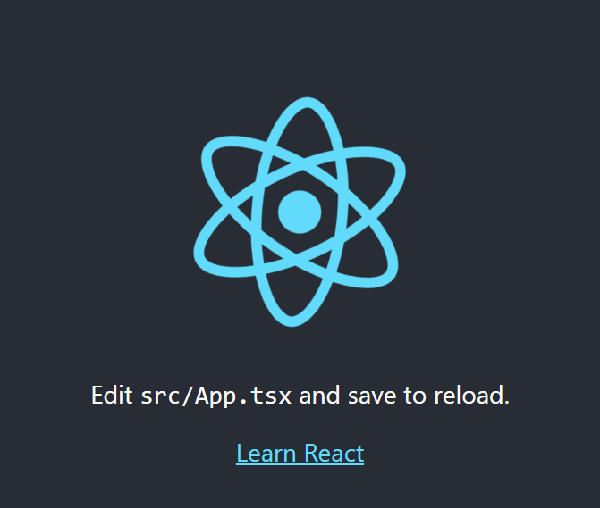

# React Basics
This tutorial covers the basic concepts of react. By the end of this tutorial, you will be able to create a new react app, understand the basic concepts of react such as states and props, understand React hooks and handling events.

-   [React Basics](#react-basics)
-   [Creating a new React App](#creating-a-new-react-app)
-   [Understanding a React App](#react-component)
    -   [Components](#react-component)
    -   [Template For Structure of Function Component](#template-for-structure-of-function-component)
    -   [Props](#props)
    -   [State](#state)
    -   [Communicating between Components](#communication-between-components)
        - [Parent to Child](#parent-to-child-component-communication)
        - [Child to Parent](#child-to-parent-component-communication)
    -   [Handling Events](#handling-events)
-   [React Hooks](#react-hooks)
    -   [UseState](#usestate)
    -   [UseEffect](#useeffect)

## Creating a New React App

Let's use **npx** and **create-react-app** to create a new React project

-   **npx** stands for Node Package Execute. It is a runner that can execute any package that you want from the npm registry without even installing that package. In this case npx tool temporarily installs the create-react-app npm package and uses it to create our project.

-   **create-react-app** is a command-line tool that we can use to quickly create a React and TypeScript app with lots of useful pieces.

1. We use the create-react-app npm package to create a React and TypeScript project by entering the following:

    ```ts
    npx create-react-app my-app --template typescript
    ```

    - Note 1: This will create a new project directory called my-app under the current directory.
    - Note 2: This will create a git repo in my-app, so you probably shouldn't do this inside a pre-existing git repository.

2. Navigate to the project directory using the command:
    ```ts
    cd my-app
    ```
3. To start the development server for React, run the command:
    ```ts
    npm start
    ```
4. Navigate to http://localhost:3000/ to see the default react page.
    - After a few seconds, a browser window opens, with our app running:
      

## React Component
React follows a Component based architecture. A component is a
repeatable html element with built-in state, business logic, and a
lifecycle. The component may be something as simple as a single html
element such as an input box, or a button, or a complex entity made up
of other components.

Components are the basic building blocks of a React application and they allow the developer to split the UI into independent and reusable
pieces where each piece can be used in isolation. 
### Creating A Function Component in React

<a href="https://codesandbox.io/s/nervous-morse-o3pwqm?file=/src/tutorial/CreateFunctionComponent.tsx" target="_blank">view in sandbox</a>

The simplest method to define a component is to write a function in Javascript. These components are also widely referred as functional stateless components but in the recent versions of React, they have the capabilities to contain state as well.
```ts
import * as React from "react";

interface Props = {name?: string};

function App (props: Props) {
  return (
      <div className="App">
        <h1>Welcome to React with Typescript Tutorial.</h1>
  </div>
);
}

export default App;
```

### A Few Things to Note About React Components:

- The root (App) component is the entry point for the React App and all other components are nested in it.
- We define a function component using a javascript function, passing the props type in as a generic parameter.
- The import statement is used to import the public classes/functions from the `react` library.
- A function can return a single top level element. 
  - div is the top level element in this case and other elements can be nested in it.
    - The attribute `className` is used to specify a CSS class name if CSS properties have been defined seperately for a class.
    - `className` attribute is used to set the value of an element’s class attribute. Using this property, the user can set the class of an element to the desired class.
- The round brackets (()) after return are used to span a JSX/TSX element across multiple lines.
- At last , the component needs to be exported from the current file, so that it can be imported somewhere else and can be used either in isolation or combination with other components for rendering on the UI.
- Elements on one line can be returned directly.
- Each instance of a component creates a new element independent of other instances of the component.
- Each component has it's own state, props, and lifecycle (which will be explored later in the tutorial).

## Template For Structure of Function Component

<a href="https://codesandbox.io/s/nervous-morse-o3pwqm?file=/src/tutorial/TemplateForFunction.tsx" target="_blank">view in sandbox</a>

```ts
import * as React from "react";

interface Props = {property1?: value1, property2?: value2}

function ComponentName (props: Props) {
 const handler = () => {
 ...
 };

 return (
  <div>Our TSX</div>
 );
};
ComponentName.defaultProps = {
 ...
};

export default ComponentName;
```

## Props
<a href="https://codesandbox.io/s/nervous-morse-o3pwqm?file=/src/tutorial/PassingProps.tsx" target="_blank">view in sandbox</a>

React components are similar to JavaScript functions and can accept arbitrary arguments called props. Since components are reusable, props are especially useful to display different content in each instance of the component. Let us extract the header elements from the previous code snippet into a new component called Header. We can then use props to say "hello" to different users.

- Create a new file in `src/` directory called `Header.tsx`
- Create and export a function called Header in the file as below:
```ts
import React from "react";

interface IProps {
  name?: string;
}

const Header = (props: IProps) => {
  return <h1>Hello, {props.name}</h1>;
};

Header.defaultProps = {
  name: "World"
};

export default Header;
```

- The above code snippet creates a new function component `Header` and prints the value of the `name` passed in the props.
- It defines a defaultProps for the component `Header` where the default value for `name` is used in case the value for props for `name` is not passed in any instance of the component.


- In App.tsx:
  - Remove the code in h1 tags.
  - Import the Header component as below:
    - ```ts
       import Header from './Header';
      ```
  - Update the contents of return as below:
    - ```ts
       <div className="App-header">
         <Header />
         <Header name="John" />
         <Header name="Jane" />
       </div>
      ```
  - Save all files and run npm start

A few things to note from the above example:

- Component.defaultProps can be used to specify default values for props.
- Components are rendered to the user interface and the component’s logic contains the data to be displayed in the view(UI).
- Curly braces ({}) in JSX/TSX are used as a connection between the data to be displayed in the view and the component’s logic for displaying the data in the view.
  - In our example, `{props.name}` will reflect the value of the property `name` in the view(html) for the cases when the values "John" and "Jane" are passed as props for the `name` property.
  - If no props are passed for an instance of the component, then it will display the default value of props.

## State 
State management is just a means of facilitating data sharing and communication among components. It creates a concrete data structure that you can read and write to reflect the state of your program.

```ts
const [counter, setCounter] = useState(0)
```

The above snippet shows creation of counter state with an intial value of 0. Using the [array destructuring](https://developer.mozilla.org/en-US/docs/Web/JavaScript/Reference/Operators/Destructuring_assignment) syntax we extract out the state variable and the function to update the counter value. 

In its most basic form, a State object is a JavaScript object that represents the part of a component that can change as a result of a user's action. States can also be thought of as a component's memory.

State update calls are asynchronous. As one cannot expect to call the update state function on one line and expect the state to be updated on the next. The reason for this is because update state methods are more of a request than an immediate order to update state. So React schedules an update to a component’s state object. When state changes, the component responds by re-rendering. Also multiple update request may be batched into one for performance reasons. 

Changes in state and/or props will both cause our React component to re-render. Changes in state, on the other hand, can only occur internally as a result of components modifying their own state. 

## Communication Between Components: 

### Parent To Child Component Communication: 
<a href="https://codesandbox.io/s/nervous-morse-o3pwqm?file=/src/tutorial/ParentChildCommunication.tsx" target="_blank">view in sandbox</a>


Passing values from a parent component to a child component is simple. We only have to pass the values as props of the child component. The child component can then use the props object to output results. In the example code you will see that CounterContent component accepts a counter prop which is then used to display the value inside div element. 
```ts
import { useState } from "react";

interface CounterContentProps {
  counter: Number;
}

function CounterContent({ counter }: CounterContentProps) {
  return <div>Counter: {counter}</div>;
}

function Counter() {
  const [counter, setCounter] = useState<number>(0);

  return (
    <>
      <CounterContent counter={counter} />
      <button onClick={() => setCounter(counter + 1)}>Increment Count</button>
    </>
  );
}
```


### Child to Parent Component Communication

<a href="https://codesandbox.io/s/nervous-morse-o3pwqm?file=/src/tutorial/ChildParentCommunication.tsx" target="_blank">view in sandbox</a>

For passing data from child component to parent component do the following steps: 
1. Declare a callback function inside the parent component. This function will get data from the child component. 
2. Pass the callback function to the child component as props.
3. Child then sends the update to the parent through the use of the callback function. 

In the example below we have four children components: 
1. CounterContent: Displays the counter value
2. IncrementCounterButton: Increments the counter value 
3. DecrementCounterButton: Decrements the counter value
4. CustomCounterButton: Sets the counter to a particular value. 

All callback functions passed to the children component are declared in Counter function which is the parent component that maintains the state value for counter.

```ts
import { useState } from "react";

interface CounterContentProps {
  counter: Number;
}

interface IncrementCounterButtonProps {
  incrementCount(): void;
}

interface DecrementCounterButtonProps {
  decrementCount(): void;
}

interface SetCounterButtonProps {
  setCount(value: number): void;
}

function CounterContent({ counter }: CounterContentProps) {
  return <div>Counter: {counter}</div>;
}

/**
 * Child component accepts a incrementCount callback function as a props.
 * The callback which is declared inside the parent component triggers a state update.
 */
function IncrementCounterButton({
  incrementCount
}: IncrementCounterButtonProps) {
  return <button onClick={() => incrementCount()}>increment Count</button>;
}

/**
 * Child component accepts a decrementCount callback function as a props.
 * The callback which is declared inside the parent component triggers a state update.
 */
function DecrementCounterButton({
  decrementCount
}: DecrementCounterButtonProps) {
  return <button onClick={() => decrementCount()}>Decrement Count</button>;
}

function CustomCounterButton({ setCount }: SetCounterButtonProps) {
  // change this value to see how child passes count value data to parent through
  // the use of callback function

  const dummyValue = 100;

  return (
    <button onClick={() => setCount(dummyValue)}>
      Set Count to {dummyValue}
    </button>
  );
}

/**
* Parent Component where state and callbacks are maintained. 
**/
function Counter() {
  const [counter, setCounter] = useState(0);

  const decrementCount = () => {
    if (counter === 0) return;
    setCounter(counter - 1);
  };

  const incrementCount = () => {
    setCounter(counter + 1);
  };

  const setCount = (value: number) => {
    setCounter(value);
  };

  return (
    <>
      <CounterContent counter={counter} />
      <IncrementCounterButton incrementCount={incrementCount} />
      <DecrementCounterButton decrementCount={decrementCount} />
      <CustomCounterButton setCount={setCount} />
    </>
  );
}
```


# Handling Events

<a href="https://codesandbox.io/s/nervous-morse-o3pwqm?file=/src/tutorial/HandlingEvents.tsx" target="_blank">view in sandbox</a>


-   React impelemnts its own system of handling events that is very similar to handling events on DOM elements. There are some syntax differences:
    -   React events are named using camelCase, rather than lower case.
    -   With JSX a function can be passed as an event handler instead of a string.

For example, the HTML

```html
<button onclick="incrementCounter()">Increment Counter</button>
```

is slightly different in React:

```html
<button onclick="{incrementCounter}">Increment Counter</button>
```

-   React provides an equivalent of each event that you might be familiar with from
    standard HTML DOM. Events typing can be imported directly from react as shown in the example below:

```ts
import { MouseEvent } from "react";

function HelloWorld() {
    const sayHello = (event: MouseEvent) => {
        event.preventDefault();
        console.log(`${event.currentTarget.tagName}: says hello, world.`);
    };

    return (
        <div>
            <button onClick={sayHello}>Submit</button>
        </div>
    );
}
export default HelloWorld;
```

For the list of all the supported events refer https://react-typescript-cheatsheet.netlify.app/docs/basic/getting-started/forms_and_events/#list-of-event-types

## React Hooks

React hooks are built-in functions which allows us to use state and other lifecycle features. The most basic hooks used by react are useState() which adds a state variable to a react component and useEffect() which is the lifecycle hook for a component. State of component referes to the data it is holding at a particular moment in time.

### useState():

<a href="https://codesandbox.io/s/nervous-morse-o3pwqm?file=/src/tutorial/UseStateExample.tsx" target="_blank">view in sandbox</a>

In this section we will see how we can add state to a React Component using the useState() hook provided by React. The useState hook takes the initial value of the state variable as an argument, the initial state can be any type you want (a string, a number, an array, an object) or a function. Only on the first render will the initial value be assigned. Each useState call returns a two-element array. The state variable is the first element of the array, followed by a function to change the variable's value.

1. We'll start by defining and initializing state for the number of times the button is clicked, by adding the a state variable as follows:

```ts
import {useState} from 'react';

function Counter() {
    const [count, setCount] = useState(0);
    ...
}
```

This line of code looks a little strange, so let's break it down:

-   When the hook useState() is invoked, it returns an array. Where the first item is the state value, and the second item is a function that updates the state. 
-   First, we import the useState from react library.
-   useState is a React function that lets us create state, passing in a default value as a parameter. In our case, we pass it a default value of 0.
-   The useState function returns an array containing two elements:
-   -   The first array element contains the current value of state.
-   -   The second array element contains a function to set state to a different value.
-   We destructure the array and store the first array element (the state value) in count, and the second array element (the function to set state) in setCount.
-   The rest of the function now has access to the count, via the count variable. The function is also able to increment the count, via the setCount variable.

2. Let's add a function to update the state of the variable:

```ts
function incrementCount() {
    setCount(count + 1);
}
```

-   Now, functions to set the piece of state take in the new state as their parameter.

3. Next we'll make the component return the count along with a button to increment the count when clicked. Final function code will be as follows:

```ts
import { useState } from "react";
function Counter() {
    const [count, setCount] = useState(0);
    function incrementCount() {
        setCount(count + 1);
    }
    return (
        <div>
            <h1>Count: {count}</h1>
            <button onClick={incrementCount}>Click me!</button>
        </div>
    );
}

export default Counter;
```

If we give this a try in the running app, we should find the count variable's value to keep incrementing by one every time the button is clicked.
After we've got our heads around the code needed to define state, accessing and setting state is fairly simple and elegant.

### useEffect():
<a href="https://codesandbox.io/s/nervous-morse-o3pwqm?file=/src/tutorial/UseEffectExample.tsx" target="_blank">view in sandbox</a>


Now let's have a look at how to invoke the code to execute at a certain point in the component's lifecycle.
Older versions of React consisted of different Lifecycle hooks that allowed a user to hook into various phases of component rendering such as componentDidMount, ComponentDidUpdate, etc. which have all been condensed into a single function called useEffect(). Let us observe how this hook behaves by printing out the count in browser console.

1. As always, we will start by importing the function from the react library:

```ts
import { useEffect } from "react";
```

2.  Next we will add the function to our existing counter component:

```ts
useEffect(() => {
    console.log(`The current count is ${count}`);
}, []);
```

Let's break down this code to understand what is happening:

-   We use React's useEffect function to hook into the component life cycle.
-   The function takes in an arrow function, which executes when the component is first rendered.
-   The function takes in a second parameter, which determines when our arrow function is called. This parameter is an array of values that, when changed, will cause the arrow function to be invoked. In our case, we pass in an empty array, so our arrow function will never be called after the first render.
-   If we now try the running app and open the console, we'll see Counter first rendering only appears once.

3.  Let's remove the second parameter into useEffect now:

```ts
useEffect(() => {
    console.log(`The current count is ${count}`);
});
```

-   Now we can see that the componenet will render everytime the value of count is changed.
-   Additionally we can also pass the variable in the array to observe only changes related to a particular value:

```ts
useEffect(() => {
    console.log(`The current count is ${count}`);
}, [count]);
```

4.  Finally, our component counter will look like:

```ts
import { useState } from "react";
import { useEffect } from "react";

function Counter() {
    const [count, setCount] = useState(0);

    function incrementCount() {
        setCount(count + 1);
    }

    useEffect(() => {
        console.log(`The current count is ${count}`);
    });

    return (
        <div>
            <h1>Count: {count}</h1>
            <button onClick={incrementCount}>Click me!</button>
        </div>
    );
}

export default Counter;
```